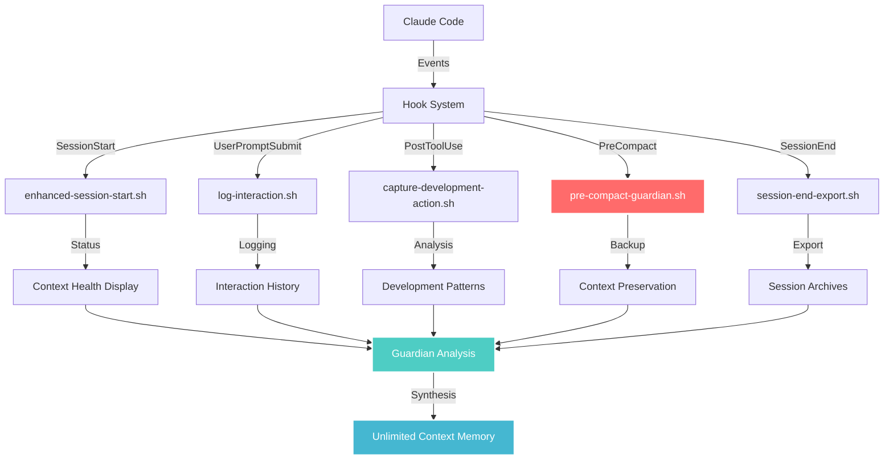

# 🚀 LostMind AI Framework - Advanced Features Guide

[](https://github.com/lostmind008/Claude-Code---LostMind-AI-FrameWork)
[](https://docs.anthropic.com/en/docs/claude-code/hooks)
[](https://www.python.org/downloads/)

## 📋 Table of Contents

- [🎯 Overview](#-overview)
- [🔧 Hook System Architecture](#-hook-system-architecture)
- [📊 Individual Hook Documentation](#-individual-hook-documentation)
- [⚙️ Configuration & Customization](#️-configuration--customization)
- [🐛 Troubleshooting Guide](#-troubleshooting-guide)
- [🔌 Extending the System](#-extending-the-system)
- [🧪 Testing & Validation](#-testing--validation)

---

## 🎯 Overview

The LostMind AI Framework's **Automated Hook Integration System** provides seamless, transparent context preservation for Claude Code through a sophisticated event-driven architecture. This guide covers advanced usage, customization, and extension capabilities for power users and developers.

### 🏗️ **System Architecture**



### 🎯 **Design Principles**

- **🔄 Event-Driven**: Responds to Claude Code lifecycle events
- **🛡️ Non-Intrusive**: Operates transparently without interrupting workflow
- **📊 Data-Driven**: Captures comprehensive context for AI analysis
- **🔧 Modular**: Individual hooks can be modified or disabled independently
- **⚡ Performance-Optimized**: Minimal overhead on Claude Code operations

---

## 🔧 Hook System Architecture

### 📁 **File Structure**

```
.claude/
├── settings.json                    # Claude Code hook configuration
├── hooks/
│   ├── hook-path-resolver.sh        # 🔧 Portable path resolution utility
│   ├── activate-lostmind-hooks.sh   # 🚀 Hook activation/management script
│   ├── enhanced-session-start.sh    # 🏁 Session initialization hook
│   ├── log-interaction.sh           # 💬 User interaction logging hook
│   ├── capture-development-action.sh # ⚡ Development action capture hook
│   ├── pre-compact-guardian.sh      # 🛡️ CRITICAL context preservation hook
│   ├── session-end-export.sh        # 📊 Session finalization hook
│   └── context-activity-logger.py   # 🐍 Centralized activity logging system
└── .lostmind_ai_context/
    ├── hook_activity.log            # Hook execution log
    ├── activity_events.jsonl       # Structured activity events
    ├── activity_report.json        # Comprehensive activity analysis
    └── hook_performance.jsonl      # Hook performance metrics
```

### 🎭 **Hook Event Types**

| Event | Trigger | Purpose | Criticality |
|-------|---------|---------|-------------|
| **SessionStart** | Claude Code session begins | Display context health, system status | Medium |
| **UserPromptSubmit** | User sends message | Log every interaction for context building | High |
| **PostToolUse** | After tool execution (Edit, Write, Bash, etc.) | Capture development actions and patterns | High |
| **PreCompact** | Before Claude Code memory compaction | **CRITICAL** - Preserve context before memory loss | Critical |
| **SessionEnd** | Claude Code session terminates | Final export, archiving, and synthesis | Medium |

### 🔄 **Hook Execution Flow**

1. **📥 Event Trigger**: Claude Code fires hook event with JSON context
2. **🔧 Path Resolution**: `hook-path-resolver.sh` determines project paths
3. **📊 Data Collection**: Hook gathers relevant context and metrics
4. **💾 Logging**: Activity logged to multiple formats (JSONL, text, JSON)
5. **🤖 Processing**: Background analysis and Guardian synthesis (if needed)
6. **✅ Completion**: Hook exits with success/failure status

---

## 📊 Individual Hook Documentation

### 🏁 **1. enhanced-session-start.sh**

**Purpose**: Advanced session initialization with comprehensive context status display.

**Trigger**: `SessionStart` event when Claude Code begins

**Key Features**:
- 🎯 Context health monitoring and status display
- 📊 Session continuity information from previous sessions
- 🧠 Guardian status and context fresh

---
*This content was automatically extracted from LostMind AI - Memory&Context Protocol. For the most up-to-date information, refer to the source project.*
