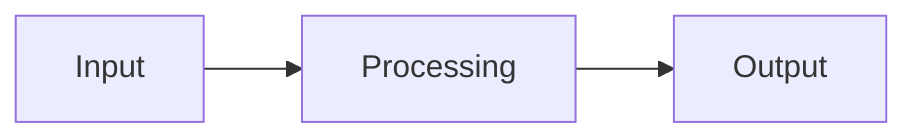

# {{projectName}} - Architecture Overview

## System Architecture

{{architectureDescription}}

## Core Components

{{#components}}
### {{componentName}}
- **Purpose**: {{purpose}}
- **Technology**: {{technology}}
- **Dependencies**: {{dependencies}}

{{/components}}

## Data Flow

## Technology Stack

| Layer | Technology | Purpose |
|-------|------------|---------|
{{#techStack}}
| {{layer}} | {{technology}} | {{purpose}} |
{{/techStack}}

## Deployment Architecture

{{deploymentDescription}}

## Security Considerations

- Authentication: {{authMethod}}
- Data Protection: {{dataProtection}}
- Access Control: {{accessControl}}

## Performance & Scalability

{{performanceNotes}}

---

*Last updated: {{lastModified}}*

---
*This content was automatically extracted from LostMind AI - Project Documentation. For the most up-to-date information, refer to the source project.*
