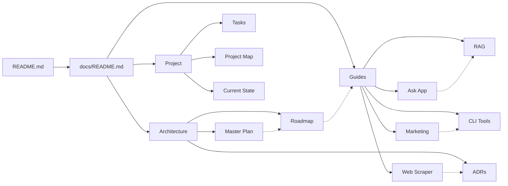

<Info>
This content was automatically extracted from LostMindAI-TurboRepo.
For the most up-to-date information, refer to the source project.
</Info>

# 📚 LostMind AI Documentation Hub

> **[← Back to Main README](../README.md)**

Welcome to the comprehensive documentation center for the LostMind AI platform. This hub provides all technical documentation, integration guides, architectural decisions, and project management resources for the LostMind AI monorepo.

## 🧭 Navigation

**Quick Links:** [Architecture](#architecture) | [Launch Planning](#launch--business-planning) | [Integration Guides](#integration-guides) | [Project Management](#project-management) | [Quick Start](#-quick-start-guides)

## 📁 Documentation Structure

### Architecture

📍 **Core architectural documentation and strategic planning:**

| Document                                                                | Description                         | Key Topics                                  |
| ----------------------------------------------------------------------- | ----------------------------------- | ------------------------------------------- |
| **[🎯 Master Plan](architecture/lostmind-master-plan.md)**              | Overall project vision and strategy | Vision, Goals, Architecture Overview        |
| **[🗓️ Implementation Roadmap](architecture/implementation-roadmap.md)** | Complete timeline with phases       | Week-by-week plan, Milestones, Dependencies |
| **[📋 Architecture Decision Records](architecture/lostmind-adrs.md)**   | Key architectural decisions         | Technology choices, Trade-offs, Rationale   |

**Related:** [Tech Stack Overview](../README.md#tech-stack) | [Project Structure](../README.md#project-structure)

### Integration Guides

🔧 **Step-by-step implementation guides for each component:**

| Guide                                                                         | App/Service           | Topics Covered                                                      |
| ----------------------------------------------------------------------------- | --------------------- | ------------------------------------------------------------------- |
| **[🤖 Ask App Integration](guides/INTEGRATION_GUIDE_FOR_ASK_APP.md)**         | `apps/ask`            | AI query interface, Google AI integration, Streaming responses      |
| **[🌐 Marketing Website](guides/MARKETING_WEBSITE_INTEGRATION_GUIDE.md)**     | `apps/marketing`      | Landing pages, Auth.js v5 integration, Stripe billing               |
| **[🧠 RAG & Embeddings](guides/RAG_EMBEDDINGS_INTEGRATION_GUIDE.md)**         | Future Implementation | Vector DB design, Embeddings strategy, Semantic search architecture |
| **[🕷️ Web Scraper Service](guides/WEB_SCRAPER_SERVICE_INTEGRATION_GUIDE.md)** | Future Implementation | FastAPI patterns, Web scraping strategies, Data extraction          |
| **[⚡ CLI Development](guides/CLI_DEVELOPMENT_TOOLKIT.md)**                   | Development Tools     | Task management, Scripts, Automation, Professional tooling          |

### Production & Quality Standards

🚨 **Critical documentation for production readiness:**

| Document                                                                             | Focus Area                               | When to Use                                  |
| ------------------------------------------------------------------------------------ | ---------------------------------------- | -------------------------------------------- |
| **[🛡️ Security Architecture Audit](security/SECURITY_ARCHITECTURE_AUDIT_REPORT.md)** | **CRITICAL**: Pre-launch security review | **REQUIRED** before v1 production deployment |
| **[⚠️ Production Technical Analysis](PRODUCTION_TECHNICAL_ANALYSIS.md)**             | Critical issues & fixes                  | Before production deployment                 |
| **[🤖 Google GenAI Developer Guide](GOOGLE_GENAI_DEVELOPER_GUIDE.md)**               | AI SDK patterns & migration              | AI feature development                       |
| **[🔐 Environment Secrets Audit](ENVIRONMENT_SECRETS_AUDIT.md)**                     | Security & configuration                 | Environment setup                            |
| **[📦 Dependency Management](DEPENDENCY_MANAGEMENT.md)**                             | Package updates & security               | Regular maintenance                          |

**See Also:** [Package Documentation](#package-documentation) | [Service Documentation](#service-documentation)

### Launch & Business Planning

🚀 **Strategic planning and business analysis:**

| Document                                                               | Focus Area                                    | Key Insights                             |
| ---------------------------------------------------------------------- | --------------------------------------------- | ---------------------------------------- |
| **[🚀 SaaS Launch Pathway](SAAS_LAUNCH_PATHWAY.md)**                   | Complete roadmap from 65% to paying customers | 6-8 weeks to launch, $95K MRR target     |
| **[📊 TurboRepo Migration Analysis](TURBOREPO_MIGRATION_ANALYSIS.md)** | Backend services integration strategy         | $2.3M ARR potential, 9 services analyzed |

**Critical Path:** [Frontend Integration](SAAS_LAUNCH_PATHWAY.md#phase-3-frontend-integration--user-experience) | [Revenue Strategy](TURBOREPO_MIGRATION_ANALYSIS.md#monetization-strategy)

### Project Management

📊 **Real-time project tracking and status:**

| Document                                                 | Purpose                      | Updated    |
| -------------------------------------------------------- | ---------------------------- | ---------- |
| **[✅ Task Tracker](project/CLAUDE_CODE_TASKS.md)**      | Claude Code task management  | Daily      |
| **[🗺️ Project Map](project/PROJECT_MAP.md)**             | File structure visualization | On changes |
| **[📈 Current State](project/CURRENT_PROJECT_STATE.md)** | Real-time project status     | Continuous |

**Dashboard:** [Project Status](project/CURRENT_PROJECT_STATE.md) | [Active Tasks](project/CLAUDE_CODE_TASKS.md#current-tasks)

### `/adrs`

Legacy Architecture Decision Records directory (retained for compatibility)

### `/reference`

Reference documentation and API specs (to be populated)

## 🚀 Quick Start Guides

### For Different Roles

#### 🆕 **Complete Beginner**

1. Start with [Beginner's Quick Start](guides/beginner/QUICK_START.md) for simple instructions
2. Follow [Environment Setup](setup/ENVIRONMENT_SETUP.md) for configuration
3. Use [Session Templates](CLAUDE_CODE_SESSION_TEMPLATES.md) for AI assistance

#### 👨‍💻 **New Developer**

1. Read the [Master Plan](architecture/lostmind-master-plan.md) for project overview
2. Review [Implementation Roadmap](architecture/implementation-roadmap.md) for current phase
3. Check [Current State](project/CURRENT_PROJECT_STATE.md) for latest status
4. Follow [CLI Development Toolkit](guides/CLI_DEVELOPMENT_TOOLKIT.md) for setup
5. Review [Dependency Management](DEPENDENCY_MANAGEMENT.md) for package updates

#### 🏗️ **Architecture Team**

- Start with [Architecture Decision Records](architecture/lostmind-adrs.md)
- Review [Master Plan](architecture/lostmind-master-plan.md#technical-architecture)
- Check integration patterns in respective [guides](guides/)

#### 🚀 **DevOps Engineer**

- [Implementation Roadmap](architecture/implementation-roadmap.md#deployment-strategy)
- [CLI Development Toolkit](guides/CLI_DEVELOPMENT_TOOLKIT.md#deployment-commands)
- Service configurations in [Web Scraper Guide](guides/WEB_SCRAPER_SERVICE_INTEGRATION_GUIDE.md#deployment)

#### 📱 **Frontend Developer**

- [Ask App Integration](guides/INTEGRATION_GUIDE_FOR_ASK_APP.md) for AI interface
- [Marketing Website Guide](guides/MARKETING_WEBSITE_INTEGRATION_GUIDE.md) for public site
- UI components in `packages/ui` ([see structure](../README.md#project-structure))

## 📋 Documentation Standards

- All documentation uses Markdown format
- Integration guides follow a consistent template
- Architecture decisions are recorded using ADR format
- Project tracking uses structured task lists

## 🔄 Documentation Sync

Documentation is automatically synchronized with code changes via the `docs-sync-guardian` agent. This ensures documentation stays up-to-date with:

- Database schema changes
- API endpoint modifications
- Environment variable updates
- Package dependencies

## 📝 Contributing to Documentation

When adding new documentation:

1. Place it in the appropriate subdirectory
2. Update this index if adding a new major document
3. Follow existing naming conventions (UPPERCASE_WITH_UNDERSCORES for guides)
4. Include a clear table of contents for documents > 500 lines
5. Update the docs-sync-guardian configuration if adding automated sync requirements

## 📦 Package Documentation

| Package        | Location              | Documentation                                                                           |
| -------------- | --------------------- | --------------------------------------------------------------------------------------- |
| UI Components  | `packages/ui`         | [Component Library](../packages/ui/README.md)                                           |
| Authentication | `packages/auth`       | [Auth.js v5 Setup](guides/MARKETING_WEBSITE_INTEGRATION_GUIDE.md#authentication)        |
| Database       | `packages/db`         | [Prisma Schema with RLS](../packages/db/README.md)                                      |
| Billing        | `packages/billing`    | [Stripe Integration](guides/MARKETING_WEBSITE_INTEGRATION_GUIDE.md#payment-integration) |
| AI Clients     | `packages/ai-clients` | [Google AI Provider Setup](guides/INTEGRATION_GUIDE_FOR_ASK_APP.md#ai-integration)      |
| Config         | `packages/config`     | [Shared Configs](../packages/config/README.md)                                          |

## 🔧 Service Documentation

| Service            | Location              | Documentation                                                                                           |
| ------------------ | --------------------- | ------------------------------------------------------------------------------------------------------- |
| AI Compute         | `services/ai-compute` | [FastAPI AI Service with OIDC Auth](../services/ai-compute/README.md)                                   |
| Document Processor | Future Implementation | [Document Processing Architecture](guides/WEB_SCRAPER_SERVICE_INTEGRATION_GUIDE.md#document-processing) |
| Crawler Engine     | Future Implementation | [Web Scraping Architecture](guides/WEB_SCRAPER_SERVICE_INTEGRATION_GUIDE.md#web-scraping)               |

## 🔗 External Resources

### Configuration Files

- **[📄 Main README](../README.md)** - Project overview and quick start
- **[🤖 CLAUDE.md](../CLAUDE.md)** - Claude Code AI assistant configuration
- **[🛡️ Guardian Agents](../.claude/agents/)** - Automated documentation sync
- **[⚙️ Environment Setup](../.env.example)** - Environment variables template

### External Documentation

- [Next.js 15 Documentation](https://nextjs.org/docs)
- [Turborepo Documentation](https://turbo.build/repo/docs)
- [FastAPI Documentation](https://fastapi.tiangolo.com/)
- [Prisma Documentation](https://www.prisma.io/docs)
- [Auth.js Documentation](https://authjs.dev/)
- [Stripe Documentation](https://stripe.com/docs)

## 🔄 Documentation Map

